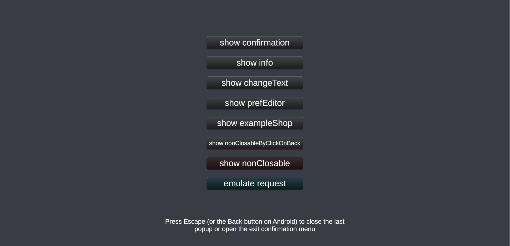
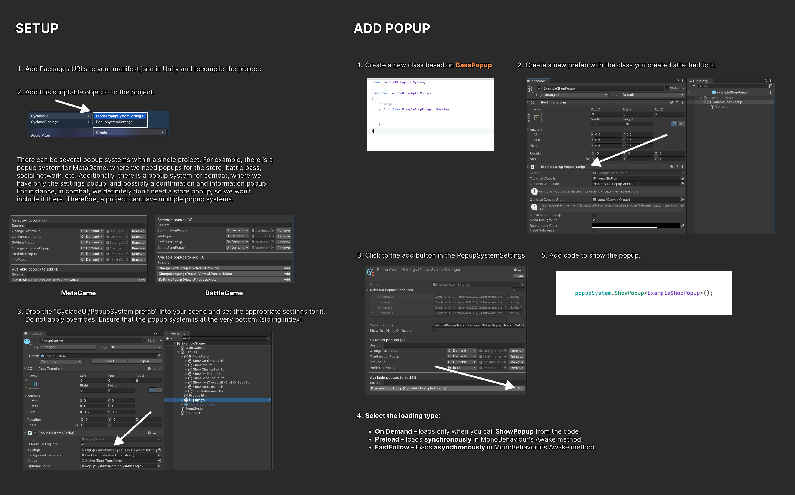
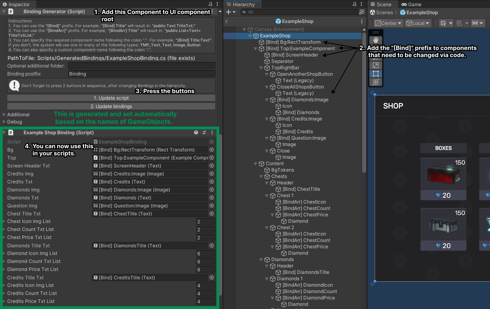
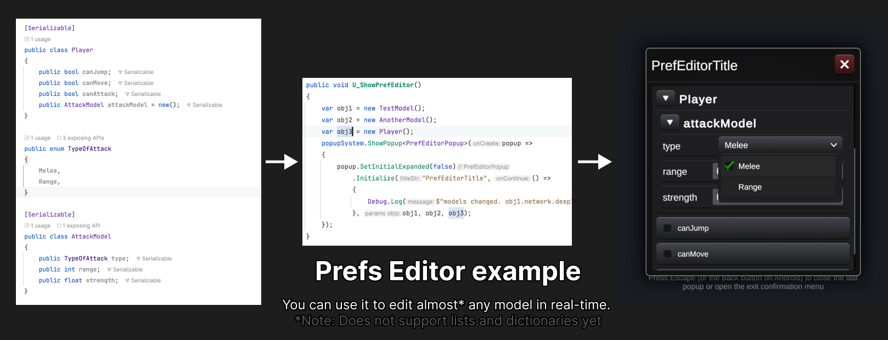

## CycladeUI



### **Objective**<br>
To make working with UI interfaces convenient and fast. Adding a new screen to the project should take as little time as possible.


### **Implementation**<br>
There are 5 libraries in the repository: 
- **CycladeBase** (required for all libraries)
- **CycladeBindings**
- **CycladeLocalization** (requires `NewtonsoftJson` and `CycladeStorage` to function)
- **CycladeStorage** (requires `NewtonsoftJson` to function)
- **CycladeUI**

**HOW TO ADD**

1. Add Packages URLs<br>
```
"com.mnvrtx.gamelogger" : "https://github.com/mnvrtx/CycladeUI.git?path=Assets/Plugins/GameLogger",
"com.mnvrtx.baseshared" : "https://github.com/mnvrtx/CycladeUI.git?path=Assets/Plugins/BaseShared",
"com.mnvrtx.cycladebase": "https://github.com/mnvrtx/CycladeUI.git?path=Assets/Plugins/CycladeBase",
"com.mnvrtx.cycladebindings": "https://github.com/mnvrtx/CycladeUI.git?path=Assets/Plugins/CycladeBindings",
"com.mnvrtx.cycladelocalization": "https://github.com/mnvrtx/CycladeUI.git?path=Assets/Plugins/CycladeLocalization",
"com.mnvrtx.cycladestorage": "https://github.com/mnvrtx/CycladeUI.git?path=Assets/Plugins/CycladeStorage",
"com.mnvrtx.cycladeui": "https://github.com/mnvrtx/CycladeUI.git?path=Assets/Plugins/CycladeUI",
"com.unity.nuget.newtonsoft-json": "3.2.1",
```
to your `manifest.json` in Unity and recompile the project. **Utilize the rules outlined in the 'Implementation' section.**

## **CycladeUI**<br>
This library is designed for working with screens and popups. All work with UI interfaces is done using the PopupSystem class. Open the project in Unity and run the scene `Assets/Scenes/ExampleScene.unity` to see examples of working with popups. The code for the examples is in the script attached to the `Controller` GameObject inside this scene.

Settings are located in the `ScriptableObjects` folder.

#### **HOW TO USE**

**SETUP**
1. Add `CycladeUI/GlobalPopupSystemSettings` and `CycladeUI/PopupSystemSettings` scriptable objects to the project.
There can be several popup systems within a single project. For example, there is a popup system for MetaGame, where we need popups for the shop, battle pass, social network, etc. Additionally, there is a popup system for combat, where we have only the settings popup, and possibly a confirmation and information popup. For instance, in combat, we definitely don't need a shop popup, so we won't include it there. Therefore, a project can have multiple popup systems.
2. Drop the "CycladeUI/PopupSystem.prefab" into your scene and set the appropriate settings for it. 
Do not apply overrides. Ensure that the popup system is at the very bottom (sibling index).

**ADD POPUP**
1. Create a new class based on `BasePopup`
2. Create a new prefab with the class you created attached to it.
3. Click to the add button in the `PopupSystemSettings`
4. Select the loading type:
  - `OnDemand` – loads only when you call `ShowPopup` from the code.
  - `Preload` – loads synchronously in MonoBehaviour's `Awake` method.
  - `FastFollow` – loads asynchronously in MonoBehaviour's `Awake` method.
5. Add code to show the popup.
```csharp
popupSystem.ShowPopup<ExampleShopPopup>();
```
  



## 🚧 **CycladeBindings** 🚧  (WORK IN PROGRESS)

This library is intended for manage states and automatically setting references in MonoBehaviour.


#### **HOW TO USE**

Open the prefab `Assets/Resources/ExampleShop.prefab`.

## **CycladeLocalization**<br>
#### **HOW TO SETUP**

1. **Create a Service Account**: Follow the instructions provided at [Google Workspace Guide](https://developers.google.com/workspace/guides/create-credentials#service-account) to create a service account.
2. **Download Credential JSON**: After creating the service account, download the credential JSON file. Replace the existing file at `Assets/Editor/CycladeSettings/google_sheets_credential.json` with the downloaded JSON file.
3. **Set Up Your Own Google Sheet**: Create a Google Sheet similar to the example provided here: [Example Google Sheet](https://docs.google.com/spreadsheets/d/1nruYmakNshqGqtoV4K-Y1zpkEgewEUswqwcvvx8tDQA/edit?usp=sharing).
4. **Update the Sheet ID**: Locate the `sheet_id` in `Assets/Editor/CycladeSettings/sheet_info.json` and replace it with the ID of your new sheet. For instance, the `sheet_id` for the example sheet is `1nruYmakNshqGqtoV4K-Y1zpkEgewEUswqwcvvx8tDQA`.
5. **Setup**: Look at [static entry point](https://github.com/mnvrtx/CycladeUI/blob/main/Assets/Scripts/StaticEntryPoint.cs). You need to add your own StaticEntryPoint and call Setup there.

#### **HOW TO USE**

1. **Ensure Enumerations for Area and Language Exist**:

```csharp
  // !Your code should contain the following enumerations in the specified namespace:
  namespace CycladeLocalization.Definition
  {
       // !Ensure that the values for `Language` correspond to the columns in your Google Sheet
       public enum Language
       {
           EN,
           RU,
       }

       // !Ensure that the `Area` values match the lists names in your sheet.
       public enum Area
       {
           General,
           Meta,
       }
   }
```

2. **Use Localization**: Utilize localization as demonstrated in the methods `ExampleController.U_ShowNonClosableByClickOnBack` or the GameObject `LocalizationTest` in `ExampleScene`. For example:
   ```csharp
   Localization.Get(Area.General, "subscriptionDescription")
   ```
3. **Change texts**: For updating texts, use `Cyclade/Localization/Update "localization.json" files from Google Sheet`.
4. **Tests**: To test LocalizationSetters, use `Cyclade/Windows/LocalizationVisualizer`.

## **CycladeStorage**<br>
#### **HOW TO USE**
1. Look at [static entry point](https://github.com/mnvrtx/CycladeUI/blob/main/Assets/Scripts/StaticEntryPoint.cs). You can add a line with debugging to your StaticEntryPoint.
2. Use code similar to the following example:
```csharp

    public class SoundSettings : IStorageSection
    {
        public bool IsMusicEnabled;

        public SoundSettings()
        {
            Reset();
        }

        public void Reset()
        {
            IsMusicEnabled = true;
        }
    }

```

<br>

```csharp
    // ...
    private void Awake()
    {
        UpdateText();
    }
    
    private void UpdateText()
    {
        var isMusicEnabled = LocalStorage.I.GetSection<SoundSettings>().IsMusicEnabled;
        btnText.text = isMusicEnabled ? "Turn OFF Music (current: ON)" : "Turn ON Music (current: OFF)";
    }
    
    public void U_Flip()
    {
        LocalStorage.I.ModifySection<SoundSettings>(q =>
        {
            q.IsMusicEnabled = !q.IsMusicEnabled;
        });
        UpdateText();
    }
    // ...
```

## **Additional**<br>


PrefEditor is available in `CycladeUI` package.
