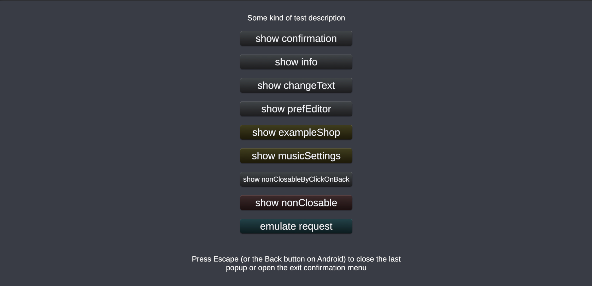

## CycladeUI (work in progress)



### **Objective**<br>
To make working with UI interfaces convenient and fast. Adding a new screen to the project should take as little time as possible.


### **Implementation**<br>
There are 2 libraries in the repository: **CycladeUI** and **CycladeBindings**.


## **CycladeUI**<br>
This library is designed for working with screens and popups. All work with UI interfaces is done using the PopupSystem class. Open the project in Unity and run the scene `Assets/Scenes/ExampleScene.unity` to see examples of working with popups. The code for the examples is in the script attached to the `Controller` GameObject inside this scene.

Settings are located in the `ScriptableObjects` folder.

#### **HOW TO USE**

**SETUP**
1. Add Packages URLs<br>
`"com.mnvrtx.cycladeui": "https://github.com/mnvrtx/CycladeUI.git?path=Assets/Plugins/CycladeUI"`,<br>
`"com.mnvrtx.cycladebindings": "https://github.com/mnvrtx/CycladeUI.git?path=Assets/Plugins/CycladeBindings"`,<br>
to your `manifest.json` in Unity and recompile the project
2. Add `CycladeUI/GlobalPopupSystemSettings` and `CycladeUI/PopupSystemSettings` scriptable objects to the project.
There can be several popup systems within a single project. For example, there is a popup system for MetaGame, where we need popups for the store, battle pass, social network, etc. Additionally, there is a popup system for combat, where we have only the settings popup, and possibly a confirmation and information popup. For instance, in combat, we definitely don't need a store popup, so we won't include it there. Therefore, a project can have multiple popup systems.
3. Drop the "CycladeUI/PopupSystem.prefab" into your scene and set the appropriate settings for it. 
Do not apply overrides. Ensure that the popup system is at the very bottom (sibling index).

**ADD POPUP**
1. Create a new class based on `BasePopup`
2. Create a new prefab with the class you created attached to it.
3. Click to the add button in the `PopupSystemSettings`
4. Select the loading type:
  - `On Demand` – loads only when you call `ShowPopup` from the code.
  - `Preload` – loads synchronously in MonoBehaviour's `Awake` method.
  - `FastFollow` – loads asynchronously in MonoBehaviour's `Awake` method.
5. Add code to show the popup.
```csharp
popupSystem.ShowPopup<ExampleShopPopup>();
```
  


## **CycladeBindings**

This library is intended for automatically setting references in MonoBehaviour. For example, open the prefab `Assets/Resources/ExampleShop.prefab`.

#### **HOW TO USE**


## **Additional**<br>


